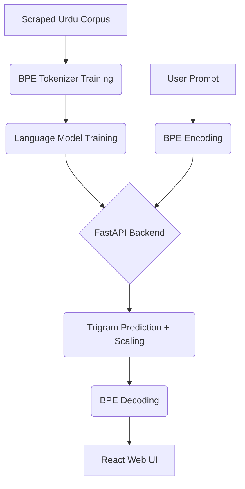

# ☾✦ Urdu Children's Story Generation System

**اردو بچوں کی کہانیاں** — A state-of-the-art NLP system designed to generate enchanting Urdu children's stories using a custom-built Trigram Language Model and a Byte-Pair Encoding (BPE) tokenizer.

---

## 🌌 Overview

This project is a complete end-to-end pipeline for Urdu story generation. It spans from raw data scraping to a production-ready web application. The system features a "Moonlit Palace"  themed interface that provides a magical, word-by-word streaming experience as the stories come to life.

### ✨ Key Features
- **Custom BPE Tokenizer**: Built from scratch to handle the unique linguistic nuances of Urdu.
- **Trigram Language Model**: Uses MLE with interpolation smoothing for coherent story continuations.
- **FastAPI Backend**: A high-performance inference server supporting SSE (Server-Sent Events) for real-time streaming.
- **React 19 Frontend**: A beautiful, responsive UI with RTL (Right-to-Left) support and dark-mode aesthetics.
- **Containerized Deployment**: Ready for the cloud with Docker and Docker Compose.
- **CI/CD Integrated**: Automated builds and tests via GitHub Actions.

---

## 🏗️ Architecture



---

## 📁 Project Structure

| Folder | Description |
| :--- | :--- |
| `Data/` | Dataset collection scripts, cleaning notebooks, and normalized Urdu corpus. |
| `Tokenizer/` | Custom BPE implementation, training scripts, and vocabulary artifacts. |
| `Trigram_LM/` | Trigram model logic, interpolation smoothing, and language model artifacts. |
| `Backend/` | FastAPI service, Pydantic schemas, and inference logic. |
| `Frontend/` | React (Vite) application with the "Moonlit Palace" design system. |
| `Deployment/` | Detailed guides for cloud deployment (Render & Vercel). |
| `.github/` | CI/CD pipelines for automated building and testing. |

---

## 🚀 Getting Started

### 🐳 Option 1: Docker (Recommended)
The easiest way to run the entire system (Frontend + Backend) is using Docker Compose:

```bash
docker-compose up --build
```
*   The **Frontend** will be available at: `http://localhost`
*   The **Backend** will be available at: `http://localhost:8000`

### 🛠️ Option 2: Manual Setup

#### **1. Backend**
```bash
cd Backend
pip install -r requirements.txt
uvicorn main:app --reload
```

#### **2. Frontend**
```bash
cd Frontend
npm install
npm run dev
```

---

## ☁️ Deployment

The system is designed to be deployed effortlessly:
*   **Backend**: Hosted on [Render](https://render.com) using the provided `Backend/Dockerfile`.
*   **Frontend**: Hosted on [Vercel](https://vercel.com) with native Vite support and `vercel.json` routing.
*   **CI/CD**: Every push to `main` triggers a GitHub Action to verify build integrity.

---

## 📜 License & Credits

Developed for NLP Assignment — **Urdu Story Generation**. 

*“Stories are the starlight of the soul.”* ☾✦
